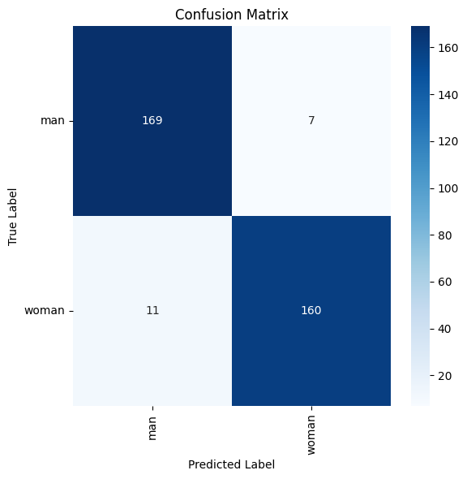
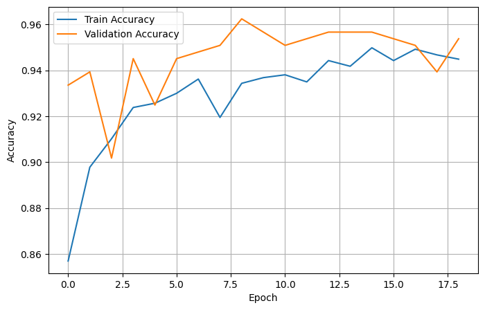
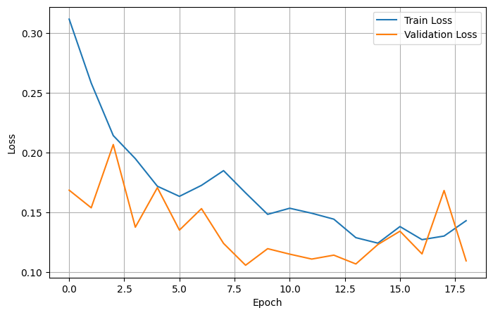

# Gender Detection from Face Images (CNN + MobileNetV2)

Binary gender classification (man / woman) from face images, built with **MobileNetV2 transfer learning** in TensorFlow/Keras and trained on Google Colab (GPU).


---

## Results

| Set | Loss | Accuracy |
|---|---|---|
| Validation (best epoch, 9) | 0.1056 | 96.24% |
| **Test** | **0.1483** | **94.81%** |

Per-class test metrics:

| Class | Precision | Recall | F1-score | Support |
|---|---|---|---|---|
| man | 0.94 | 0.96 | 0.95 | 176 |
| woman | 0.96 | 0.94 | 0.95 | 171 |
| **Overall accuracy** | | | **0.95** | 347 |

The model misclassified 18 of 347 test images (11 woman predicted as man, 7 man predicted as woman).

<p align="center">
  
</p>

<p align="center">
  
  
</p>

---

## Dataset

- 2,307 face images in two classes: **man** (1,173) and **woman** (1,134), so the data is effectively balanced.
- No corrupted images were found.
- Stratified split with `random_state=42`:

| Split | Images |
|---|---|
| Train | 1,614 |
| Validation | 346 |
| Test | 347 |

The dataset is not included in this repository. It is expected in a one-folder-per-class layout:

```
genderdetc_dataset/
├── man/
└── woman/
```

---

## Approach

1. **EDA:** class balance, corrupted-file check, image size analysis, sample visualisation.
2. **Data preparation:** DataFrame of image paths and labels (`man` = 0, `woman` = 1), stratified 70/15/15 split.
3. **Input pipeline:** `tf.data`, decode to RGB, resize to 224 x 224, batch size 16.
4. **Augmentation (training only):** random horizontal flip, rotation (0.1) and zoom (0.1).
5. **Model:** frozen ImageNet-pretrained MobileNetV2 backbone with a small trainable head.
6. **Training:** Adam (lr = 0.001), binary cross-entropy, early stopping on `val_loss` (patience 10, best weights restored).
7. **Evaluation:** test accuracy, classification report, confusion matrix, misclassified-image inspection.
8. **Inference:** `predict_gender(image_path)` returns the class and its confidence.

### Model architecture

```
Input (224, 224, 3)
  -> Data augmentation (flip / rotation / zoom, training only)
  -> MobileNetV2 preprocess_input
  -> MobileNetV2 (ImageNet weights, frozen)
  -> GlobalAveragePooling2D
  -> Dense(256, ReLU)
  -> Dropout(0.3)
  -> Dense(1, Sigmoid)   # P(woman), threshold 0.5
```

| Parameters | Count |
|---|---|
| Total | 2,586,177 |
| Trainable (head) | 328,193 |
| Non-trainable (frozen backbone) | 2,257,984 |

Training ran for 19 epochs (maximum 40) before early stopping. The best epoch was 9.

---

## Repository Structure

```
.
├── Gender-detection-documented.ipynb   # full notebook with code, outputs and documentation
├── assets/                             # result plots used in this README
│   ├── accuracy_curve.png
│   ├── loss_curve.png
│   └── confusion_matrix.png
└── README.md
```

---

## How to Run

The notebook was developed on **Google Colab**.

1. Open `Gender-detection-documented.ipynb` in Colab and select a GPU runtime.
2. Upload your dataset zip to Google Drive and set `zip_path` in the notebook to its location.
3. Run all cells top to bottom.

To run locally instead, install the dependencies and change the dataset paths:

```bash
pip install tensorflow==2.20.0 numpy pandas matplotlib seaborn scikit-learn pillow
```

### Predict on a new image

```python
label, confidence = predict_gender("path/to/image.jpg")
print(label, confidence)
```

---

## Limitations

- Small dataset (2,307 images) and a single train/validation/test split, so the reported accuracy carries some uncertainty. One test image is worth about 0.29 percentage points.
- The notebook does not analyse how labels were created or the age, skin-tone or ethnic composition of the data, so performance across subgroups is unknown.
- The backbone stayed frozen; no fine-tuning was done.
- In the misclassified images that were viewed, glasses, side poses, occlusion and unusual lighting appear often. This was a visual check of 16 images, not a measured statistic.

## Future Work

- Fine-tune the top MobileNetV2 blocks with a low learning rate and compare with the frozen baseline.
- Compare other backbones (EfficientNet, ResNet) on the same split.
- Add face detection and alignment before classification.
- Review misclassified images for label noise and measure how often each difficult condition occurs.
- Use k-fold cross-validation for a more stable estimate.

## Responsible Use

Predicting gender from a face is a sensitive application. The model reproduces the binary labels of its training data and makes mistakes, so it should not be used for decisions that affect people.

---

## Author

**Abhay Kadam**
[GitHub](https://github.com/ENGABHAY) | [LinkedIn](https://linkedin.com/in/kadamabhay)
